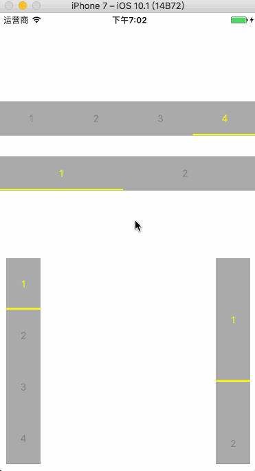

# SlideSegment
A Horizontal/Vertical Segmented Control With Fully Autolayout Supported.

##Usage:

         let doSomething:(Int) -> Void = {
            num in
            print("clicked:\(num)")
         }

         let segment = SlideSegmentSelector.init(singlePage: true, length: 180, withAnimate: true,direction: .horizontal,doClosure: doSomething)

##Arguments:

         singlePage: Put all segment in one screen.

         length:Width/Height for every segment(Only effected if SinglePage disabled).

         withAnimate: The moving animaton of the line at the bottom of the button clicked.

         direction: .horizontal / .vertical

         do: A closure, type: (Int) -> Void

##Demo:(See more in the project)

